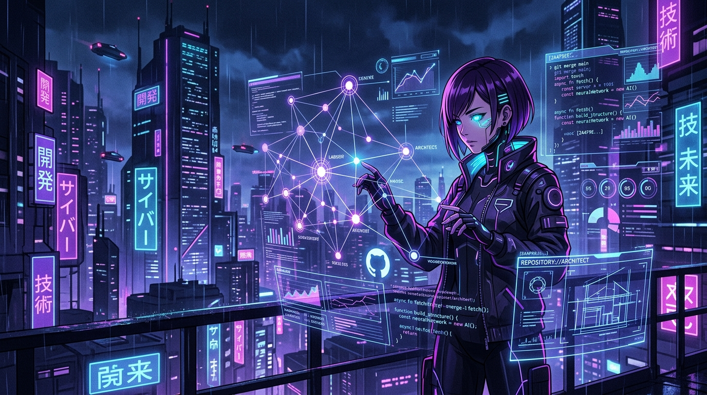

<div align="center">

<!-- High-Res Cyberpunk Anime Art Banner -->


<br/><br/>


<p align="center">
  
</p>

<!-- Quick Action Badges -->
<p align="center">
  <a href="https://aibuildinfra.com/"></a>
  <a href="https://github.com/AI-BuildInfra/Humancraft-UI"></a>
  <a href="mailto:shreevarshan35@gmail.com"></a>
</p>

---

</div>

## ⛩️ `system.diagnostics` // Core Identity

```typescript
interface DeveloperCore {
  name: "Shree Varshan";
  role: "Tech Founder & AI Infrastructure Architect";
  headquarters: "AI Build Infra (aibuildinfra.com)";
  coreDomains: ["Model Context Protocol (MCP)", "E-E-A-T Entity Graphs", "Autonomous Agents", "Full-Stack Web/ERP"];
  currentMission: "Building deterministic, anti-slop software ecosystems with human-first UI/UX";
}
```

---

## ⚡ Featured Engineering & Flagship Works

<table>
  <tr>
    <td width="50%" valign="top">
      <div align="center">
        <a href="https://github.com/AI-BuildInfra/Humancraft-UI">
          
        </a>
      </div>
      <p align="center"><b>🌌 Google Antigravity Official MCP Server</b></p>
      <p>Pioneering Model Context Protocol infrastructure to enforce E-E-A-T entity reconciliation, audit content graphs, and prevent AI slop generation.</p>
      <p align="center">
        
        
        
      </p>
    </td>
    <td width="50%" valign="top">
      <div align="center">
        <a href="https://github.com/Shree-varshan-430/kana-dojo">
          
        </a>
      </div>
      <p align="center"><b>🥋 Minimalist Japanese Kana Dojo</b></p>
      <p>Ultra-fast interactive platform designed for frictionless Japanese Kana mastery with instant keyboard drill feedback and modern cyberpunk minimalism.</p>
      <p align="center">
        
        
        
      </p>
    </td>
  </tr>
</table>

---

## 🛠️ Cyber Tech Arsenal

<div align="center">


<br/><br/>

| Sector | Tech Stack & Tooling |
| :--- | :--- |
| **🤖 AI & MCP Protocols** | `Model Context Protocol (MCP)` `Google Antigravity` `ProofGraph` `Agentic Automation` |
| **🎨 Modern Frontend & UX** | `React` `Next.js` `TypeScript` `Tailwind CSS` `Generative UI` `MDX` |
| **⚙️ Backend & Systems** | `Node.js (ESM)` `Python` `REST APIs` `JSON-RPC` `ERPNext Business Systems` |
| **🚀 DevOps & Registry** | `GitHub Actions (CI/CD)` `Docker` `NPM Registry Publishing` `Glama` `Smithery` |

</div>

---

## 📊 Live Activity & Contribution Matrix

<div align="center">

<!-- 3D Contribution Graph / Activity Matrix -->
<picture>
  <source media="(prefers-color-scheme: dark)" srcset="https://github-profile-summary-cards.vercel.app/api/cards/profile-details?username=Shree-varshan-430&theme=tokyonight">
  
</picture>

<br/><br/>

<!-- Detailed Metrics Grid -->
<table align="center" width="100%">
  <tr>
    <td width="50%" align="center">
      
    </td>
    <td width="50%" align="center">
      
    </td>
  </tr>
  <tr>
    <td width="50%" align="center">
      
    </td>
    <td width="50%" align="center">
      
    </td>
  </tr>
</table>

<br/>

<!-- Cyber Status Bar -->
<p align="center">
  
</p>

</div>
